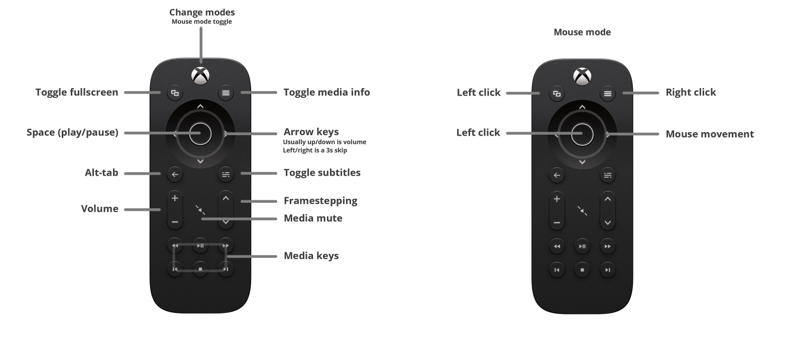

# Universal Windows movie remote including mouse mode

This is a set of configs and guide to create a very capable PC movie remote usable with any movie player.

Introduction in [this](medium.com) article.

This is not a complete step by step description - its meant to give inspiration, and you have to adapt it to your needs and key combinations.

## Hardware requirements:

- [XBONE Multimedia Remote](https://support.xbox.com/en-US/xbox-one/accessories/xbox-one-media-remote-info) (recommended, but any IR remote can be used - configs are shared for this remote)
- [Flirc](https://flirc.tv/) dongle - can be ordered through Amazon or other retailers

## Software used

- [AHK](https://www.autohotkey.com/) for simple scripting - capturing keystrokes and launching commands
- [NeatMouse](https://neatdecisions.com/products/neatmouse/) for keyboard mouse emulation

## Guide

### Remote
First, remote button layout. I mostly use default shortcuts, with some exceptions (shift-arrow for framestepping, shift-w for subtitles) - nevertheless I included the two configs here to download.

Make your own button configuration with your IR remote on the Flirc application for the default mode for your favourite video player (I use [MPC-BE](https://sourceforge.net/projects/mpcbe/)). You can save your config with the File menu in .fcfg files.

### Mouse mode
For the Mouse mode, we'll use a very simple utility, NeatMouse - it allows for a hotkey to swap between a keyboard-controlled 'mouse emulation' that we can use with the remote. Numpad is the default and would be the obvious choice for these keys, but sadly its complicated to make Flirc work with those so I configured simply the arrow keys + del-end-pageDown for clicks.

For

### Swapping between the two modes

We'll be using Flirc's command line util to swap between these two modes with a unique keystroke. This keystroke is watched by a 